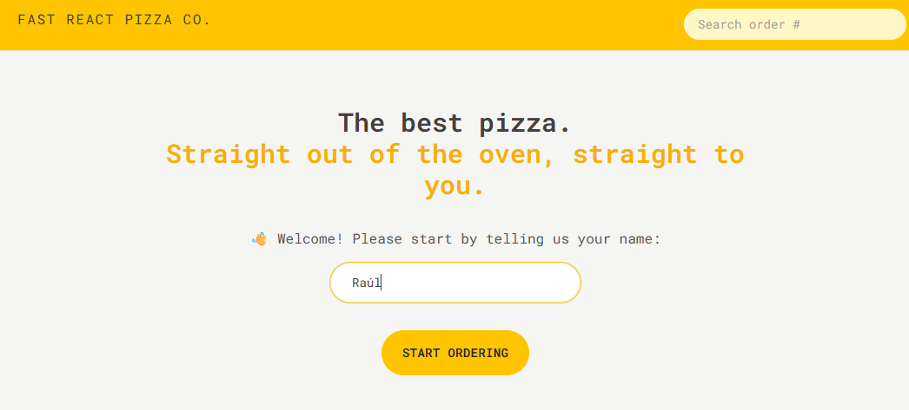
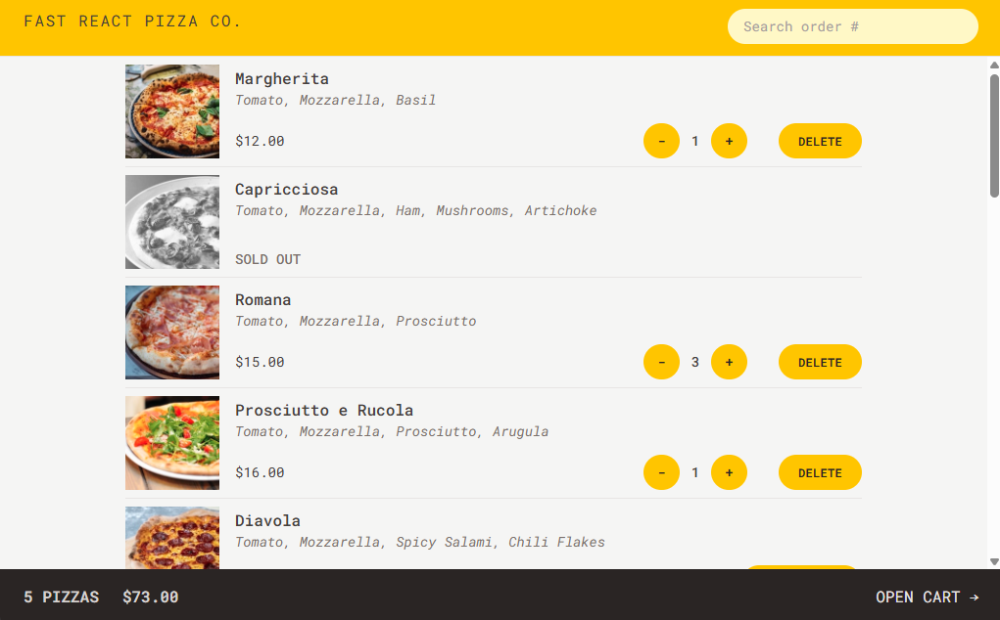
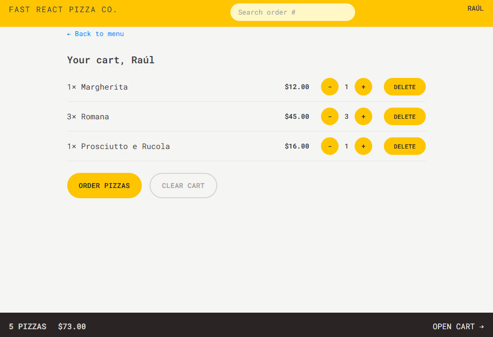
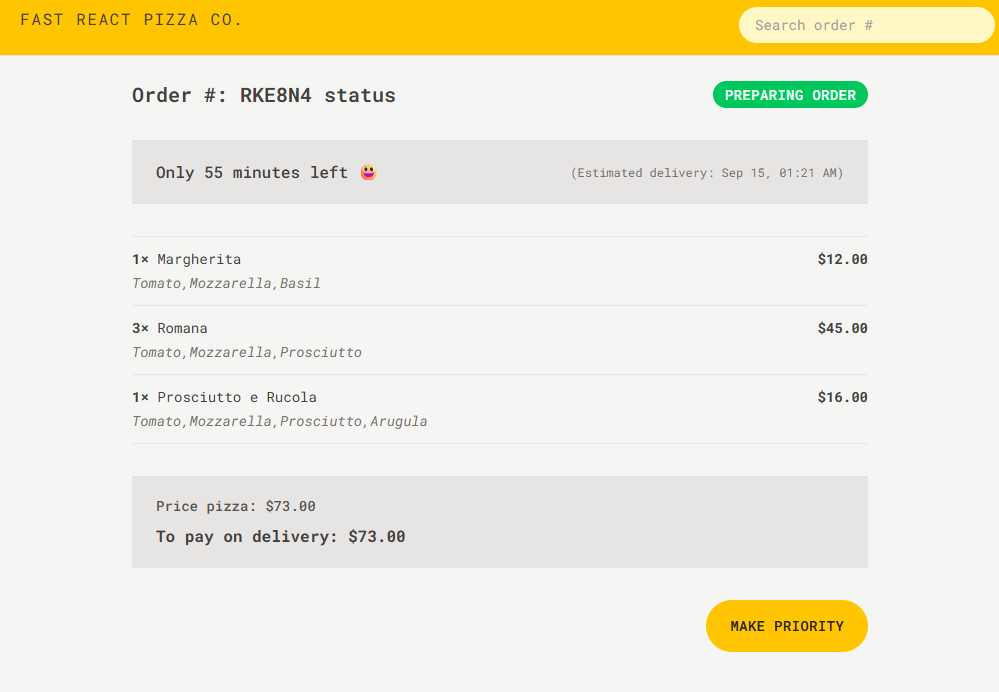

# 🍕 Fast React Pizza

A small pizza ordering application built with **React**, **TypeScript**,
**Redux Toolkit**, and **React Router**.

The application simulates a pizza ordering workflow: browsing the menu,
adding pizzas to a cart, creating an order, retrieving an existing
order, and updating an order to priority. It was developed as a learning
project and progressively adapted from the original course exercise
using a feature-first architecture, TypeScript, Redux Toolkit, React
Router Data APIs, Zod, and service-layer abstractions.

## Preview









## Features

- React 19
- TypeScript
- Vite
- React Router
- React Router loaders and actions
- React Router `useFetcher`
- Redux Toolkit
- React Redux
- Typed Redux hooks
- Feature-based architecture
- Shopping cart management
- Pizza menu
- Order creation
- Order lookup by ID
- Order priority update
- Form validation with Zod
- Browser geolocation
- Reverse geocoding with OpenStreetMap Nominatim
- Loading and error states
- Reusable shared components
- Custom Redux hooks
- Service layer
- Tailwind CSS
- React Compiler

## Ordering Flow

The main ordering flow is:

```text
Menu
  │
  ▼
Add pizzas to cart
  │
  ▼
Cart
  │
  ▼
Create order
  │
  ├── Optional geolocation
  │       │
  │       ▼
  │   Reverse geocoding
  │
  ▼
Validate form with Zod
  │
  ▼
Restaurant API
  │
  ▼
Order created
  │
  ▼
Order details
```

Users can also search for an existing order using its order number.

## Geolocation

The application can obtain the user's current browser location through
the **Geolocation API**.

The latitude and longitude are then sent to **Nominatim**, the
reverse-geocoding service provided by OpenStreetMap, to obtain a
human-readable address.

The implementation keeps these responsibilities separated:

```text
Browser Geolocation API
        │
        ▼
Geolocation Service
        │
        ▼
Position { latitude, longitude }
        │
        ▼
Geocoding Service
        │
        ▼
Nominatim
        │
        ▼
Address
```

The external API communication is isolated inside the service layer
rather than being handled directly by React components.

## State Management

The application uses **Redux Toolkit** for global state management.

The Redux store is divided into domain-specific slices:

- `userSlice`
- `cartSlice`

The cart slice manages:

- Cart items
- Adding items
- Removing items
- Increasing quantity
- Decreasing quantity
- Clearing the cart
- Calculating total quantity
- Calculating total price

The user slice manages:

- Username
- Delivery address
- Geolocation
- Address lookup status
- Address lookup errors

The application uses `configureStore`, typed Redux hooks, and selectors
that operate against the global `RootState`.

## React Router

The application uses the modern **React Router Data API** architecture.

Routes can define:

- `loader` --- loads data before rendering a route
- `action` --- handles mutations and form submissions
- `errorElement` --- handles route-level errors
- `useFetcher` --- loads or submits data without navigation

Example route responsibilities:

```text
/menu
  └── loader → getMenu()

/order/new
  └── action → validate + createOrder()

/order/:id
  ├── loader → getOrder(id)
  └── action → updateOrder(id)
```

This keeps data loading and mutations close to the route that owns them
while keeping API communication inside the service layer.

## Form Validation

Order creation is validated with **Zod** before the request is sent to
the API.

The form data is received through the React Router action:

```text
Form
  │
  ▼
FormData
  │
  ▼
Object
  │
  ▼
Zod safeParse()
  │
  ├── Invalid
  │     └── Return field errors
  │
  └── Valid
        │
        ▼
     createOrder()
```

The schema also validates the cart items included in the order request.

## Project Structure

```text
src/

├── features/
│   │
│   ├── cart/
│   │   ├── components/
│   │   │   ├── Cart/
│   │   │   ├── CartItem/
│   │   │   ├── CartOverview/
│   │   │   ├── EmptyCart/
│   │   │   └── UpdateCartQuantity/
│   │   │
│   │   ├── pages/
│   │   │   └── CartPage.tsx
│   │   │
│   │   ├── schemas/
│   │   │   └── cartItem.schema.ts
│   │   │
│   │   ├── cartSlice.ts
│   │   ├── cart.types.ts
│   │   └── initialState.ts
│   │
│   ├── menu/
│   │   ├── components/
│   │   │   ├── Menu/
│   │   │   └── MenuItem/
│   │   │
│   │   ├── loaders/
│   │   │   └── menu.loader.ts
│   │   │
│   │   ├── pages/
│   │   │   └── MenuPage.tsx
│   │   │
│   │   └── menu.types.ts
│   │
│   ├── order/
│   │   ├── actions/
│   │   │   ├── order.action.ts
│   │   │   └── update-order.action.ts
│   │   │
│   │   ├── components/
│   │   │   ├── CreateOrder/
│   │   │   ├── Order/
│   │   │   ├── OrderItem/
│   │   │   ├── SearchOrder/
│   │   │   └── UpdateOrder/
│   │   │
│   │   ├── loaders/
│   │   │   └── order.loader.ts
│   │   │
│   │   ├── pages/
│   │   │   └── CreateOrderPage.tsx
│   │   │
│   │   ├── schemas/
│   │   │   └── order.schema.ts
│   │   │
│   │   └── order.types.ts
│   │
│   └── user/
│       ├── components/
│       │   ├── CreateUser/
│       │   └── UserName/
│       │
│       ├── userSlice.ts
│       ├── initialState.ts
│       └── types.ts
│
├── layout/
│   ├── AppLayout/
│   └── Header/
│
├── routes/
│   └── AppRouter.tsx
│
├── services/
│   ├── geocoding/
│   ├── geolocation/
│   └── restaurant.service.ts
│
├── shared/
│   └── components/
│
├── stores/
│   ├── hooks.ts
│   └── store.ts
│
├── types/
│
└── utils/
```

## Architecture

The application follows a **feature-first architecture**.

Each feature owns the code related to its domain:

- Components
- Pages
- Types
- Schemas
- Redux state
- Loaders
- Actions

For example, the order feature contains the components, schemas,
loaders, and actions required to create, retrieve, and update orders.

External communication is isolated in the service layer:

```text
React components
      │
      ▼
React Router / Redux
      │
      ▼
Feature logic
      │
      ▼
Services
      │
      ├── Restaurant API
      ├── Geolocation API
      └── Nominatim
```

Shared UI components such as buttons, links, loaders, and error messages
remain outside individual features and can be reused throughout the
application.

The project also uses path aliases:

```text
@/ → src/
```

to keep imports readable and avoid long relative paths when crossing
feature boundaries.

## Technologies

- React 19
- TypeScript
- React Router DOM
- Redux Toolkit
- React Redux
- Zod
- Tailwind CSS
- Vite
- ESLint
- React Compiler
- OpenStreetMap Nominatim API
- Fast React Pizza API

## Getting Started

### Install dependencies

```bash
npm install
```

### Start the development server

```bash
npm run dev
```

### Build for production

```bash
npm run build
```

### Run ESLint

```bash
npm run lint
```

## Learning Goals

This project was created to practice:

- React with TypeScript
- Feature-first architecture
- Redux fundamentals
- Redux Toolkit
- `createSlice`
- `configureStore`
- Typed Redux hooks
- Redux selectors
- Async thunks
- React Router Data APIs
- Route loaders
- Route actions
- `useFetcher`
- Form handling with `FormData`
- Zod validation
- Browser geolocation
- Reverse geocoding
- Service layer architecture
- Separation of concerns
- Loading and error states
- Reusable components
- Type-safe application structure
- Tailwind CSS
- Path aliases with Vite and TypeScript

## Acknowledgements

This project was developed as part of **Jonas Schmedtmann's React
course**.

The original course exercise was progressively adapted and redesigned
using TypeScript, Redux Toolkit, React Router Data APIs, Zod, Tailwind
CSS, a feature-first architecture, and a service layer for external API
communication.

Rather than following the original JavaScript project structure, the
application was reorganized to practice patterns commonly used in larger
React applications.

The goal was not only to reproduce the functionality of the exercise,
but also to understand the responsibilities of each layer and how modern
React ecosystem tools work together.
